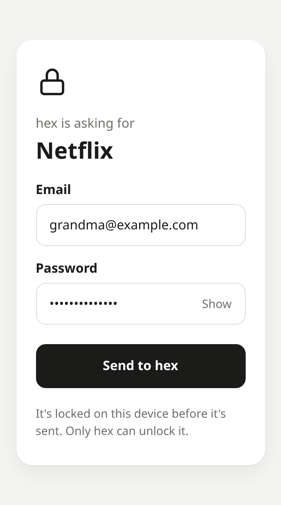
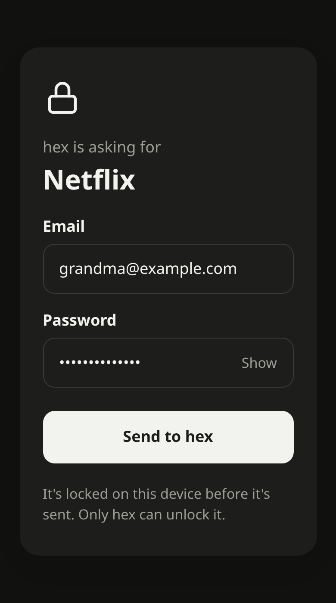

# enclave

Your AI agent needs your Netflix password. Instead of asking in chat, it sends you a link. You open it, type the password (or let your password manager fill it) and tap **Send**. It's locked in your browser before it leaves, so only your agent can open it. The agent keeps it in a vault of its own and uses it later without ever seeing it.

<p>
  
  
</p>

```
hex   I need your Netflix login to finish this: https://moonlit-lynx-37.convex.site/k3Jd8vQ2…
you   open it, type, tap Send
hex   saved Netflix: email, password
```

It works out of the box with a hosted relay. No accounts, no keys to set up, nothing for the person to install.

## Set up your agent

**Agents with a shell** (Claude Code, Codex, Cursor, Gemini CLI, OpenCode and [30 more](https://github.com/vercel-labs/skills)) get it as a skill:

```sh
npx skills add AVGVSTVS96/enclave
```

The skill teaches the agent to send a link instead of asking in chat, and runs enclave with `npx`, so there's nothing else to install.

**Agents that use MCP** get the same thing as tools. Add the server below, and add this line to the agent's instructions, because tools alone don't stop a model from asking in chat:

> Never ask for a password, API key or other secret in chat. Use the enclave tools.

<details>
<summary><b>Claude Code</b></summary>

```sh
/plugin marketplace add AVGVSTVS96/enclave
/plugin install enclave@enclave
```

Or as MCP tools:

```sh
claude mcp add enclave -- npx -y enclave-link mcp
```

</details>

<details>
<summary><b>Codex</b></summary>

```sh
codex mcp add enclave -- npx -y enclave-link mcp
```

Codex stops a tool after 60 seconds by default. To let `wait_for_secret` wait as long as the link lives, add this under `[mcp_servers.enclave]` in `~/.codex/config.toml`:

```toml
tool_timeout_sec = 1800
```

</details>

<details>
<summary><b>Cursor, Claude Desktop, Windsurf, Cline, Roo Code, Kiro, Junie, Factory</b></summary>

They all take the same JSON:

```json
{
  "mcpServers": {
    "enclave": { "command": "npx", "args": ["-y", "enclave-link", "mcp"] }
  }
}
```

| App | Where it goes |
| --- | --- |
| Cursor | `~/.cursor/mcp.json`, or `.cursor/mcp.json` in a project |
| Claude Desktop | Settings → Developer → Edit Config |
| Windsurf | `~/.codeium/windsurf/mcp_config.json` |
| Cline | MCP Servers → Configure MCP Servers |
| Roo Code | `.roo/mcp.json` |
| Kiro | `~/.kiro/settings/mcp.json` |
| JetBrains Junie | `~/.junie/mcp/mcp.json` |
| Factory | `~/.factory/mcp.json` |

</details>

<details>
<summary><b>VS Code and GitHub Copilot</b></summary>

`.vscode/mcp.json`:

```json
{
  "servers": {
    "enclave": { "type": "stdio", "command": "npx", "args": ["-y", "enclave-link", "mcp"] }
  }
}
```

</details>

<details>
<summary><b>Gemini CLI</b></summary>

```sh
gemini extensions install https://github.com/AVGVSTVS96/enclave
```

</details>

<details>
<summary><b>Grok Build</b></summary>

```sh
grok mcp add enclave -- npx -y enclave-link mcp
```

</details>

<details>
<summary><b>OpenCode</b></summary>

`opencode.json`:

```json
{
  "mcp": {
    "enclave": { "type": "local", "command": ["npx", "-y", "enclave-link", "mcp"] }
  }
}
```

</details>

<details>
<summary><b>Zed</b></summary>

In Zed's `settings.json`:

```json
{
  "context_servers": {
    "enclave": { "command": "npx", "args": ["-y", "enclave-link", "mcp"], "env": {} }
  }
}
```

</details>

<details>
<summary><b>OpenClaw, Hermes and other chat assistants</b></summary>

Assistants that talk to you through Telegram, Discord or WhatsApp should use the skill (`npx skills add AVGVSTVS96/enclave`), so the link reaches you in the chat. For MCP instead:

```sh
openclaw mcp add enclave --command npx --arg -y --arg enclave-link --arg mcp
```

Hermes, in `~/.hermes/config.yaml`:

```yaml
mcp_servers:
  enclave:
    command: npx
    args: ["-y", "enclave-link", "mcp"]
    timeout: 1800
```

</details>

<details>
<summary><b>Goose</b></summary>

Run `goose configure`, choose **Add Extension → Command-line Extension**, enter `npx -y enclave-link mcp`, and set the timeout to 1800 seconds.

</details>

**ChatGPT, Claude.ai and the Gemini and Grok apps** can't use enclave yet. They run in the cloud with no computer of yours behind them, and enclave keeps the vault on the computer where the agent runs. What would make them work is an enclave server you run yourself that the app reaches over remote MCP; it doesn't exist yet. Their desktop and coding-agent versions above work today.

**Your own code** can use the TypeScript SDK; see [SDK](#sdk).

## How it works

```
agent                          relay (Convex)                   person's browser
─────                          ──────────────                   ────────────────
makes a one-time key pair
enclave ask ─── open ──────────▶  stores an empty request
         ◀── link ───────────
sends https://…/<id>#key=…  ──────────────────────────────────▶ opens the link
                                                                 reads the key after #
                                                                 (browsers never send it)
                                                                 encrypts the answer
                               stores encrypted bytes ◀───────── POST, once
enclave wait ◀── live update ───
decrypts, saves to its vault
deletes the request ────────▶  gone
```

- **The relay can't read anything.** The key it would need never leaves the agent's computer. The public key travels in the part of the link after `#`, which browsers don't send to servers, so the relay doesn't even learn what was asked for.
- **Links work once and expire.** The first answer wins, and the request is deleted as soon as the agent picks it up, or after 30 minutes.
- **No polling.** `enclave wait` holds a live Convex subscription and wakes up the moment the answer lands.

## Using a secret without seeing it

```sh
enclave run KEY="OpenAI API key/key" sh -c 'curl -s https://api.openai.com/v1/models -H "Authorization: Bearer $KEY"'
```

`run` works like `env`, except the values come from the vault, and anywhere one shows up in the command's output it's replaced with `[hidden KEY]`. Quote the command so your own shell doesn't expand `$KEY` first.

To type a password into a login form, pipe it straight into whatever does the typing: `enclave get Netflix password | <typer>`. A field named `totp` holds a 2FA setup key, and `enclave get GitHub totp` gives its current 6-digit code.

## CLI

```sh
npm install -g enclave-link      # or run any of these with npx -y enclave-link
```

| Command | Does |
| --- | --- |
| `enclave ask <name> [field…]` | Prints a link asking for `<name>`. Fields default to `password`. |
| `enclave wait <name>` | Waits for the answer and saves it. Exits 1 if the link expires first. |
| `enclave run VAR=<name>/<field>… <command…>` | Runs a command with secrets in its environment, hidden in its output. |
| `enclave get <name> <field>` | Prints a saved value, for a pipe or `$(…)`. |
| `enclave list` | Saved names and their fields, never values. |
| `enclave rm <name>` | Deletes a saved item. |
| `enclave mcp` | Serves the tools below over MCP (stdio). |

`ENCLAVE_FROM` sets the name the page shows ("hex is asking for…"), `ENCLAVE_HOME` sets where the vault lives (`~/.enclave`), and `ENCLAVE_RELAY` points at your own relay.

## MCP tools

| Tool | Does |
| --- | --- |
| `request_secret` | Makes the link. If the client supports [URL elicitation](https://modelcontextprotocol.io/specification/2025-11-25/client/elicitation), it offers to open the link for the person right there; otherwise it gives the agent the link to send. |
| `wait_for_secret` | Returns the moment the person taps Send, with the field names it saved. |
| `run_with_secrets` | Runs a command with secrets in its environment and hides them in the output. |
| `list_secrets` | Names and fields, never values. |

There's no tool that returns a secret's value.

## SDK

```ts
import { vault } from "enclave-link"

const { url, wait } = await vault.ask("Netflix", ["email", "password"])
// send url to the person
await wait()

await vault.run(["sh", "-c", 'curl -u "$EMAIL:$PASSWORD" https://example.com'], {
  EMAIL: "Netflix/email",
  PASSWORD: "Netflix/password",
})
```

`vault` reads `ENCLAVE_FROM`, `ENCLAVE_HOME` and `ENCLAVE_RELAY`. For anything else, `openVault({ from, home, relay })` makes one of your own. It also has `get`, `list` and `remove`, the same as the CLI.

## Security

The encryption is [HPKE](https://www.rfc-editor.org/rfc/rfc9180) (RFC 9180) with X25519, HKDF-SHA256 and AES-128-GCM, built on the browser's own Web Crypto with no libraries, and tested against the RFC's test vectors. Answers are padded, so the relay can't even tell how long a password is.

The vault keeps each item encrypted in `~/.enclave/items`, sealed to the vault's own key in `~/.enclave/key.json` and bound to the item's name. The item files are safe to back up anywhere. The key is what unlocks them, so treat it like an SSH key.

What enclave can't protect against:

- **Whoever runs the relay sends you the page.** Your browser downloads the page, including the code that locks your password, from the relay each time you open a link. What the relay stores can't be read, but if someone took over the relay's Convex account, they could change the page to copy what you type before locking it. Every website that encrypts in your browser works this way. The page is about 300 lines in [`page/`](page) plus the encryption in [`src/hpke.ts`](src/hpke.ts), served with a strict Content Security Policy, so you can read exactly what it runs. If you'd rather trust nobody's relay, [host your own](#host-your-own).
- **Anyone with the link can answer it first.** They still can't read anything, but they could send a fake answer. If that happens, the page says "This link doesn't work anymore" when you open it.
- **Phishing.** A link can say anyone is asking. Only send secrets to agents you asked for help.
- **An agent that wants to see a secret can.** enclave keeps secrets out of the chat and out of tool results, and `run` hides their exact values in output. But an agent with a shell on the same computer could still read its own vault. enclave stops secrets from leaking by accident, not a model that's trying.

## Host your own

The relay is a [Convex](https://convex.dev) app, so self-hosting is a few commands, on Convex's cloud or the [open-source Convex backend](https://github.com/get-convex/convex-backend):

```sh
git clone https://github.com/AVGVSTVS96/enclave && cd enclave
npm install
npm run dev -- --once    # sign in to Convex and create your project
npm run deploy
```

Then point agents at it with `ENCLAVE_RELAY=https://<your-deployment>.convex.cloud`.

## Develop

```sh
npm run dev      # builds the page and runs a Convex dev deployment
npm run check    # typecheck and tests
npm run build    # bundles the CLI, SDK and types into dist/
```

| Path | What's there |
| --- | --- |
| `convex/` | The relay: requests, rate limits and two HTTP routes, in 133 lines |
| `page/` | The page people see, built into one HTML file by `scripts/page.ts` |
| `src/hpke.ts` | The encryption, shared by the page and the agent |
| `src/vault.ts` | `ask`, `wait`, `get`, `run` and the rest of the SDK |
| `src/mcp.ts` | The MCP server |
| `skills/enclave/` | The Agent Skill |

## License

MIT
